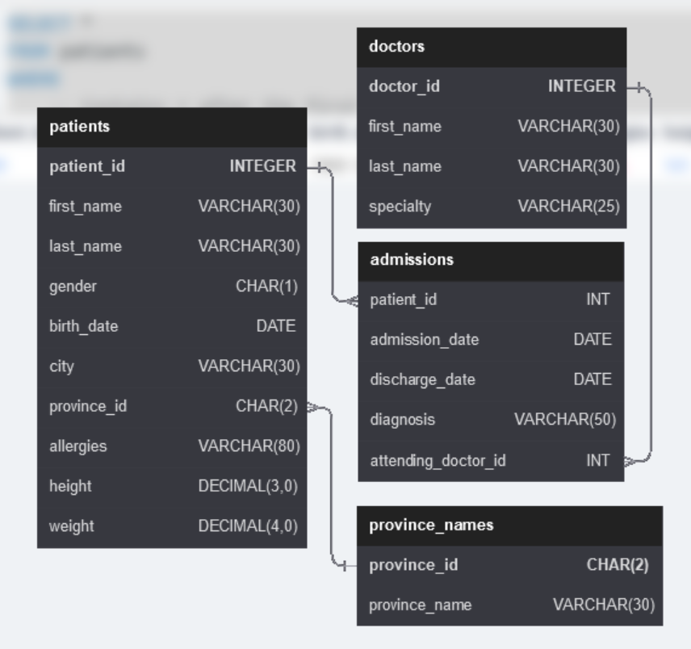
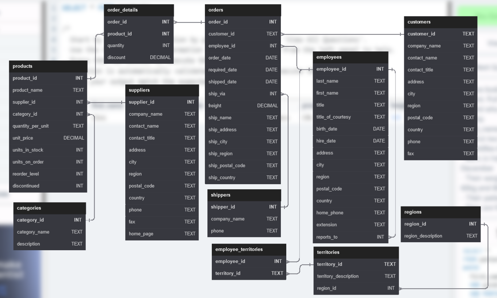

# Laboratorio de bases de datos
## Programación SQL

En el laboratorio se resolvieron distintos casos de programación con SQL para el siguiente esquema de base de datos:

### Esquema de base de datos de Hospital


### Esquema de base de datos northwind



Cada integrante se encarga de resolver cuatro problemas de codigo de SQL; 2 problemas de la base de datos Hospital y 2 problemas de la base de datos northwind.


## Integrante: Gabriel Angulo, Carne: B90457

#### Pregunta:
- Base de datos: Hospital
- Dificultad: Media

Show patient_id, attending_doctor_id, and diagnosis for admissions that match one of the two criteria:
1. patient_id is an odd number and attending_doctor_id is either 1, 5, or 19.
2. attending_doctor_id contains a 2 and the length of patient_id is 3 characters.

#### Solucion:
```sql
SELECT 
	patient_id
    ,attending_doctor_id
    ,diagnosis
FROM 
	admissions
WHERE 
	-- If patient_id is an odd number and attending_doctor_id is either 1, 5, or 19
	(patient_id % 2 != 0 AND attending_doctor_id IN (1, 5, 19))
    -- OR If attending_doctor_id contains a 2 and the length of patient_id is 3 characters
    OR (attending_doctor_id LIKE '%2%' AND LEN(patient_id) = 3)
```

#### Pregunta:
- Base de datos: Hospital
- Dificultad: Dificil

We are looking for a specific patient. Pull all columns for the patient who matches the following criteria:
    - First_name contains an 'r' after the first two letters.
    - Identifies their gender as 'F'
    - Born in February, May, or December
    - Their weight would be between 60kg and 80kg
    - Their patient_id is an odd number
    - They are from the city 'Kingston'

#### Solucion:
```sql
SELECT *
FROM patients
WHERE
	-- Contains r after the first two letters
	first_name LIKE '__r%'
    -- Identifies gender as F
    AND gender = 'F'
    -- Born in February, May, or December
    AND MONTH(birth_date) IN (2, 5, 12)
    -- Weight between 60 and 80
    AND weight between 60 AND 80
    -- patiend_id is odd
    AND patient_id % 2 != 0
    -- City is Kingston
    AND city = 'Kingston'
```

#### Pregunta:
- Base de datos: Northwind
- Dificultad: Facil

Show the city, company_name, contact_name from the customers and suppliers table merged together.
Create a column which contains 'customers' or 'suppliers' depending on the table it came from.

#### Solucion:
```sql
SELECT 
	city
    ,company_name
    ,contact_name
    -- Show customers for this data
    ,'customers' AS type
FROM customers

-- Merge tables
UNION

SELECT
	city
    ,company_name
    ,contact_name
    -- Show suppliers for this data
    ,'suppliers' AS type
FROM suppliers

```

#### Pregunta:
- Base de datos: Northwind
- Dificultad: Dificil

#### Solucion:
```sql
SELECT
	e.first_name
	,e.last_name
	,COUNT(o.order_id) As num_orders
    -- Displays "On Time" if the order shipped_date is less or equal to the required_date, else display "Late"
	,(
		CASE
    		WHEN o.shipped_date <= o.required_date THEN 'On Time'
    		ELSE 'Late'
  		END
	) AS shipped
FROM employees e
LEFT JOIN orders o 
ON e.employee_id = o.employee_id

-- Grouping to count show order count
GROUP BY
	e.first_name
	,e.last_name
	,shipped

-- Order by employee last_name, then by first_name, and then descending by number of orders.
ORDER BY
	e.last_name
	,e.first_name
	,num_orders DESC
```

## Integrante: Kristhel Quesada, Carne: C06153

#### Pregunta:
- Base de datos: Hospital
- Dificultad: Dificil

Each admission costs $50 for patients without insurance, and $10 for patients with insurance. All patients with an even patient_id have insurance.

Give each patient a 'Yes' if they have insurance, and a 'No' if they don't have insurance. Add up the admission_total cost for each has_insurance group.

#### Solucion:
```sql
SELECT
-- Find if even (has insurance) or odd (doesn't have)
CASE
WHEN patient_id % 2 = 0 THEN 'Yes'
	WHEN patient_id % 2 != 0 THEN 'No'
END AS has_insurance,
-- Then create a sum per patient and condition
SUM(
  CASE
WHEN patient_id % 2 = 0 THEN 10
          ELSE 50
END)
as admission_total
-- Extract the data form admission
FROM admissions
-- Order it by
group by has_insurance
```

#### Pregunta:
- Base de datos: Hospital
- Dificultad: Media

Display patient's full name,
height in the unit feet rounded to 1 decimal,
weight in the unit pounds rounded to 0 decimals,
birth_date,
gender non abbreviated.

Convert CM to feet by dividing by 30.48.
Convert KG to pounds by multiplying by 2.205.

#### Solucion:
```sql
-- Change the titles
select
-- change to full name
	concat(first_name, ' ', last_name) AS 'patient_name',
	-- conversions
	ROUND(height / 30.48, 1) as 'height "Feet"',
	ROUND(weight * 2.205, 0) AS 'weight "Pounds"', birth_date,
	-- change to non abbreviated
CASE
WHEN gender = 'M' THEN 'MALE'
                  WHEN gender = 'F' THEN 'FEMALE'
END AS 'gender_type'
from patients
```

#### Pregunta:
- Base de datos: Hospital
- Dificultad: Dificil

We need a breakdown for the total amount of admissions each doctor has started each year. Show ther doctor_id, doctor_full_name, specialty, year, total_admissions for that year.

#### Solucion:
```sql
SELECT
  -- doctor ID
  d.doctor_id as doctor_id,
  -- doctor full name
  CONCAT(d.first_name,' ', d.last_name) as doctor_name,
  -- speciality
  d.specialty,
  -- Extract the year only
  YEAR(a.admission_date) as selected_year,
  -- Counts based on Group By sorting
  COUNT(*) as total_admissions
-- extract it from doctors and rename it as d
-- also combines two tables to match doctors id
FROM doctors as d
  LEFT JOIN admissions as a ON d.doctor_id = a.attending_doctor_id
-- Organize data as
GROUP BY
  doctor_name,
  selected_year
ORDER BY doctor_id, selected_year
```

#### Pregunta:
- Base de datos: Northwind
- Dificultad: Dificil

Show how much money the company lost due to giving discounts each year, order the years from most recent to least recent. Round to 2 decimal places

#### Solucion:
```sql
Select
	-- extract the year
	YEAR(o.order_date) AS 'order_year' , 
    -- obtain the total discount based on o.order_date
	ROUND(SUM(p.unit_price * od.quantity * od.discount),2) AS 'discount_amount' 

-- Extract data from orders
-- also combine/extract data from order_details and products
from orders o 
JOIN order_details od ON o.order_id = od.order_id
JOIN products p ON od.product_id = p.product_id

-- Organization sets
group by YEAR(o.order_date)
order by order_year desc;
```

## Integrante: Santiago Herrera, Carne: C13721
#### Pregunta:
- Base de datos: Hospital
- Dificultad: Hard

Show patient_id, first_name, last_name from patients whos diagnosis is 'Epilepsy' and doctors first name is 'Lisa'.

#### Solucion:
```sql
SELECT 
pa.patient_id,
pa.first_name,
pa.last_name,
doc.specialty
FROM 
patients pa,
doctors doc,
admissions ad

where 
pa.patient_id = ad.patient_id
and ad.attending_doctor_id = doc.doctor_id
and ad.diagnosis = 'Epilepsy' AND doc.first_name = 'Lisa'
```

#### Pregunta:
- Base de datos: Hospital
- Dificultad: Hard


Primary diagnosis is stored in the admissions table.
Show patient_id, weight, height, isObese from the patients table.
Display isObese as a boolean 0 or 1.
Obese is defined as weight(kg)/(height(m)2) >= 30.
weight is in units kg.
height is in units cm.


#### Solucion:
```sql
SELECT 
patient_id,
weight,
height,
weight,
weight/Power(CASt(height as float) / 100,2) >= 30 AS isObese
from
patients
```

#### Pregunta:
- Base de datos: Hospital
- Dificultad: Dificil

We need a breakdown for the total amount of admissions each doctor has started each year. Show the doctor_id, doctor_full_name, specialty, year, total_admissions for that year. 

#### Solucion:
```sql
select 
doc.doctor_id,
concat(doc.first_name, ' ', doc.last_name) as doctor_full_name,
doc.specialty,
YEAR(ad.admission_date) as year_selected,
count(*) as total_admissions

from 
doctors doc
LEFT JOIN admissions as ad ON doc.doctor_id = ad.attending_doctor_id
group by
doctor_full_name,
year_selected

```

#### Pregunta:
- Base de datos: Northwind
- Dificultad: Media

Show the category_name and the average product unit price for each category rounded to 2 decimal places.

#### Solucion:
```sql
SELECT 
c.category_name,
ROUND(AVG(prod.unit_price),2) AS average_product_unit_price
from 
products prod
join categories c on c.category_id=prod.category_id
group by c.category_name
```
## Integrante: Evelyn Wu, Carne: B82870

#### Pregunta:
- Base de datos: Hospital
- Dificultad: Media

Display every patient's first_name.
Order the list by the length of each name and then by alphabetically.

#### Solucion:
```sql
SELECT first_name
FROM patients
order by
  len(first_name),
  first_name;
```


#### Pregunta:
- Base de datos: Hospital
- Dificultad: Dificil

#### Solucion:
```sql
SELECT pr.province_name
FROM patients AS pa
  JOIN province_names AS pr ON pa.province_id = pr.province_id
GROUP BY pr.province_name
HAVING
  SUM(gender = 'M') > SUM(gender = 'F');
```

#### Pregunta:
- Base de datos: Northwind
- Dificultad: Facil

Show all the contact_name, address, city of all customers which are not from 'Germany', 'Mexico', 'Spain'.

#### Solucion:
```sql
SELECT contact_name, address, city
FROM customers
WHERE Country NOT IN ('Germany','Mexico', 'Spain')

```

#### Pregunta:
- Base de datos: Northwind
- Dificultad: Facil

Show the city, company_name, contact_name of all customers from cities which contains the letter 'L' in the city name, sorted by contact_name

#### Solucion:
```sql
SELECT city, company_name, contact_name
FROM customers
WHERE city LIKE '%L%'
ORDER BY contact_name

```