# Parte Teorica

### 1. ¿Que es una base de datos relacional y cuales son sus caracterısticas fundamentales?
Una base de datos relacional es un sistema organizado de almacenamiento de datos que permite almacenar y recuperar informacion de manera eficiente. Ademas, la caracteristica de relacional significa que por estructura sus tablas estan relacionadas mediante columnas de forma eficiente.

Las caracteristicas fundamentales son:

-   Tabla (Table): Estructura principal donde se almacenan los datos.
-   Fila (Registro) (Row/Record): Representa un unico registro dentro de la tabla.
-   Columna (Campo) (Column/Field): Representa un atributo o caracteristica de la entidad.
-   Clave Primaria (Primary Key): Campo unico que identifica cada fila en una tabla.
-   Clave Extranjera (Foreign Key): Campo que establece una relacion entre dos tablas.
-   Índice (Index): Estructura de datos que mejora la velocidad de las operaciones de la base de datos.
-   Vista (View): Tabla virtual que resulta de una consulta sobre una o mas tablas.

### 2. ¿Cual es la diferencia entre una clave primaria y una clave candidata en una base de datos relacional?

La clave primaria es un conjunto de atributos utilizado para identificar de manera unica cada tupla en una tabla. Mientras que, una clave candidata es un conjunto de atributos que puede indentificar de manera unica una tabla. La clave primaria identifica una fila como unica, la clave candidata indentifica una tabla como unica.

### 3. ¿Que son las claves foraneas y como se utilizan para mantener la integridad referencial en una base de datos?

Las claves foraneas son atributos que solo puede tomar valores presentes en otra tabla como referencia. Esto permite buscar relaciones entre tablas de forma eficiente para la entraccion de la informacion.

### 4. ¿Que es una transaccion en el contexto de bases de datos y cuales son las propiedades ACID que debe cumplir?

Una transaccion es una unidad que agrupa operaciones sobre los datos de una base de datos. Estos deben cumplir con las propiedades ACID:

-   Atomicidad: Todas las operaciones se ejecutan como una sola unidad.
-   Coherencia: La base de datos debe terminar en un estado coherente luego de la transaccion.
-   Aislamiento: Las operaciones de una transaccion no deben afectar las operaciones de otra transaccion.
-   Durabilidad: Los cambios en la base de datos luego de una transaccion debe ser duraderos.

### 5. ¿Que son las vistas (views) en SQL y cuales son los beneficios y limitaciones de su uso?

Las vistas son tablas virtuales que resultan de una consulta sobre una o mas tablas. Como principal beneficio es el de no crear mas tablas de lo necesario en una base de datos, pero la limitacion es que al ser operaciones constantes ejecutandose en una o mas tablas el performance puede disminuir.

### 6. ¿Que es la normalizacion en bases de datos y cuales son las diferentes formas normales (normal forms)?

La normalizacion consiste en organizar la base de datos con el objetivo de reducir la reduncancia al minimo y de mejorar la integridad de la informacion.

Las formas normales definen estructuras de las tablas de las bases de datos para cumplir con los objetivos anteriores. Formas normales:
-   1FN: Tabla que no contiene grupos repetitivos de datos.
-   2FN: Cada columna no clave depende de la clave primaria.
-   3FN: Ninguna columna no clave depende de otra columna no clave.
-   4FN: No hay dependencias funcionales multivaluadas.
-   5FN: No hay dependencias funcionales que no sean dependencias de la clave primaria o dependencias de union naturales.

### 7. ¿Como funcionan los ındices en SQL y cual es su impacto en el rendimiento de las consultas? 

En la base de datos de SQL se crean indices en tablas o conjuntos de tablas, estos datos se copian en una estructura aparte la cual es utilizada para las consultas en lugar de la totalidad de las tablas.
Los indices en SQL permiten identificar una tabla de forma mas eficiente sin la necesidad de buscarlo por nombre o datos dentro de la tabla, esto permite mejorar considerablemente el rendimiento de las consultas.

### 8. ¿Que es SQL Injection y cuales son las mejores practicas para prevenir este tipo de ataque?

Es una tecnica en la que los comandos SQL se ejecutan desde los campos de entrada del formulario o los parametros de consulta de URL. Si una SQL injection tiene exito, personas no autorizadas pueden leer, crear, actualizar, o incluso eliminar registros de las tablas de la base de datos.

Las mejores practicas para prevenir este tipo de ataque es de validar todas las entradas de usuarios o incluso se pueden utilizar declaraciones preparadas.

### 9. ¿Que son los procedimientos almacenados (stored procedures) en SQL y como pueden mejorar la eficiencia y seguridad de las operaciones de base de datos?

Los procedimientos almacenados son modulos precompilados de SQL. Estos modulos son operaciones realizadas a tablas. Al ser precompiladas mejoran la eficiencia y seguridad de las operaciones de base de datos.

### 10. ¿Como se implementan las relaciones uno a uno, uno a muchos y muchos a muchos en una base de datos relacional y que consideraciones se deben tener en cuenta en cada caso?

Las relaciones se realizan a partir de las claves foraneas que hacen referencia a claves primarias. Las relaciones uno a uno es cuando un registro de una tabla hace referenca a solo un registro de otra tabla. Las relaciones uno a muchos es cuando un registro de una tabla hace referencia a muchos registros de otra tabla. Las relaciones muchos a muchos es cuando muchos registros hacen referencia a muchos registros de otra tabla. Todas estas relaciones se realizan con claves foraneas.

# Parte Practica

Para la parte practica se realizan distintas ejecuciones de codigo de SQL en una base de datos creada.

## 1. Creacion de la base de datos y tablas
### a. Definicion y creacion de las tablas Cursos, Requisitos, y Descripciones usando el esquema proporcionado.

Mediante el codigo de sql [Crear Base de Datos](src/Create_Database.sql) se crea la base de datos respectiva con el esquema proporcionado.

Evidencia de la creacion de la base de datos Tarea6:

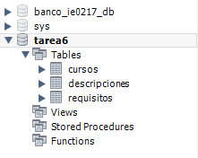

Se asegura de implementar las claves primarias, candidatas y foraneos. Verificacion de las llaves foraneas de las tablas Descripciones y Requisitos:

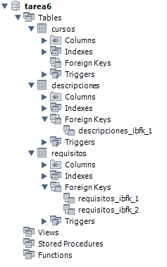

## 2. Insercion de datos

### a. Insercion de la informacion basica de los cursos y sus requisitos segun el plan de estudios proporcionado.

Mediante el codigo de sql [Insertar Informacion Basica](src/Insert_1_Basic_Data.sql) se inserta la informacion basica de los cursos con el plan de estudios proporcionado.

Antes de insertar los datos:

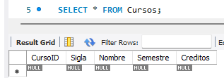
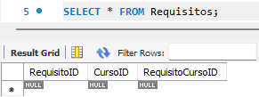

Despues de insertar los datos:

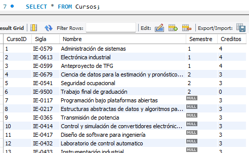
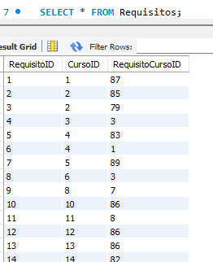

Notas:

-   Debido a que el plan de estudios proporcionado no posee informacion de dificultad de curso ni descripcion no se inserta nada en la tabla Descripciones.

-   Los cursos optativos se asigna un valor NULL en la columna Semestre de la tabla Cursos debido a que no poseen asignacion de semestre.

-   Los cursos de bachillerato que son requisitos de cursos de licenciatura se asigno un valor -1 en la columna Semestre de la tabla Cursos debido a que no son parte de ningun semestre del plan de estudios de licenciatura.

### b. Agregar dos cursos nuevos y completar la informacion requerida y sus respectivos requisitos

Mediante el codigo de sql [Insertar Cursos Nuevos](src/Insert_2_New_Courses.sql) se insertan dos cursos nuevos.

Antes de insertar los cursos nuevos:

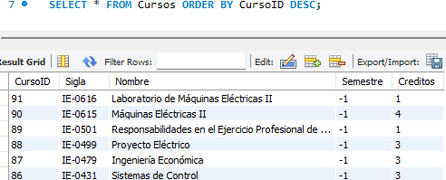
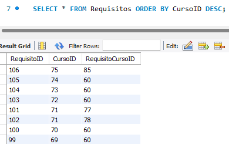

Despues de insertar los cursos nuevos:

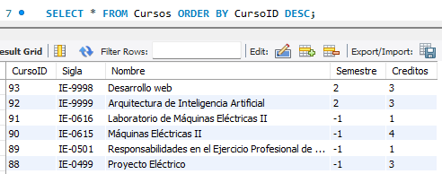
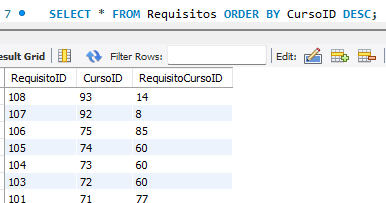

En las imagenes anteriores se aprecian que las nuevos dos filas anadidas en las tablas.

## 3. Consultas
### a. Realizar consultas para listar todos los cursos con su sigla, nombre, semestre, creditos, descripcion, y dificultad

Mediante el codigo de sql [Consultar datos](src/Consult_1_Data.sql) se realiza la consulta respectiva.

Resultados de la consulta:

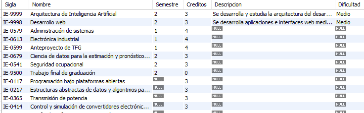

### b. Realizar consultas para listar todos los requisitos de un curso especifico

Mediante el codigo de sql [Consultar requisitos](src/Consult_2_Required_Course.sql) se realiza la consulta de los requisitos de un curso especifico.

Resultados de la consulta:

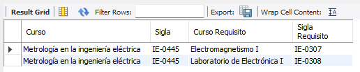

### c. Realizar consultas para listar los cursos que no son optativos

Mediante el codigo de sql [Consultar cursos no optativos](src/Consult_3_Optative_Course.sql) se realiza la consulta de los cursos que no son optativos.

Resultados de la consulta:

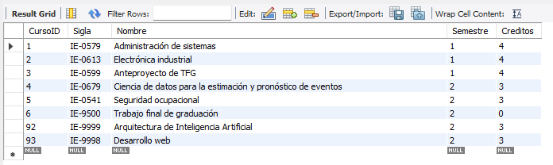

Nota:

-   La condicion IS NOT NULL hace referencia a no seleccionar los cursos optativos debido a que se sigue la convencion de que los cursos optativos tiene un valor en la columna Semestre de NULL.
-   La condicion != -1 hace referencia a no seleccionar los cursos de bachillerado debido a que se sigue la convecion de que los cursos de bachillerato que son requisitos de cursos de licenciatura, pero no son cursos optativos de licenciatura tienen un valor en la columna Semestre de -1.

### d. Listar los cursos que pertenecen al semestre X.

Mediante el codigo de sql [Consultar cursos del semestre X](src/Consult_4_Semester_Course.sql) se realiza la consulta de los cursos que pertenecen a un semestre especifico.

Resultados de la consulta:

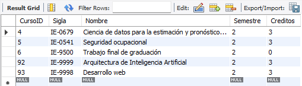

## 4. Actualizaciones

### a. Actualizar el nombre y creditos de 3 cursos optativos.

Mediante el codigo de sql [Actualizar el nombre y creditos](src/Update_1_Courses.sql) se actualiza el nombre y creditos de tres cursos.

Antes de la actualizacion:

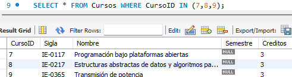

Despues de la actualizacion:

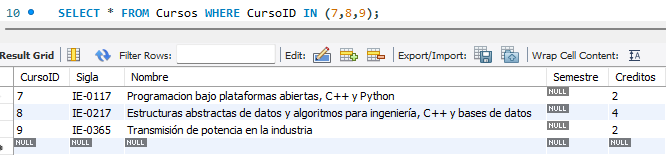

Nota: Los codigos de SQL de la parte a y b estan dentro del mismo query. En el query posee comentarios sobre lo que se hace en cada accion.
### b. Actualizar la descripcion y dificultad de 3 cursos existentes.

Mediante el codigo de sql [Actualizar descripcion y dificultad](src/Update_1_Courses.sql) se actualiza la descripcion y dificultad de tres cursos.

Antes de la actualizacion:

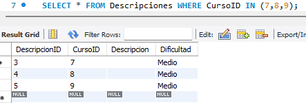

Despues de la actualizacion:

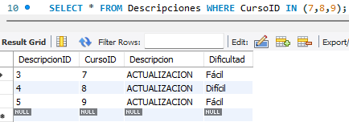

## 5. Eliminaciones

### a. Eliminar un curso inventado y 2 cursos del plan y asegurarse de que tambien se eliminen sus descripciones asociadas.

Mediante el codigo de sql [Eliminar 3 cursos](src/Delete_1_Courses.sql) se elimina un curso inventado y dos cursos del plan.

Antes de eliminar los cursos:

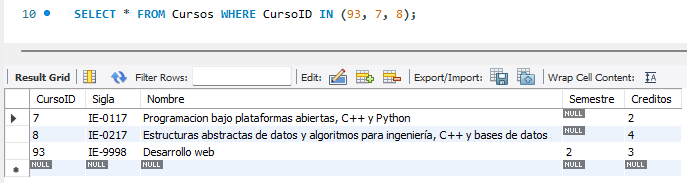
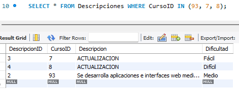
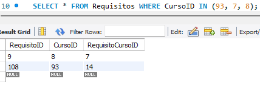

Despues de eliminar los cursos:

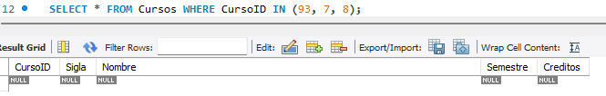
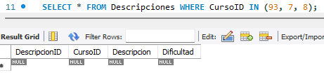

Tambien se toma en consideracion que los cursos eliminados no pueden ser requisitos de otros cursos, por lo tanto tambien se elimina que sean requisitos.

Antes de eliminar:

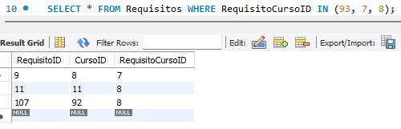

Despues de eliminar:

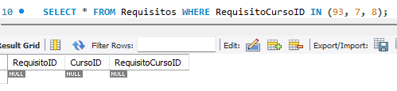

Nota: la propiedad ON DELETE CASCADE al crear la base de datos deberia permitir la eliminacion de las filas de las tablas Descripciones y Requisitos que referencian filas de la tabla Cursos al eliminar una entrada. MySQL genero mensajes de error a pesar de tener la propiedad asignada, por lo que se opto por eliminar las entradas en las tablas Descripciones y Requisitos y por ultimo en Cursos para evitar el error.

### b. Eliminar requisitos de dos cursos existentes.

Mediante el codigo de sql [Eliminar Requisitos](src/Delete_2_Requires.sql) se eliminan los requisitos de dos cursos.

Antes de eliminar los requisitos:

Despues de eliminar los cursos:

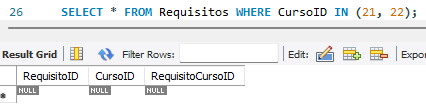