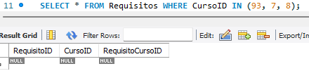
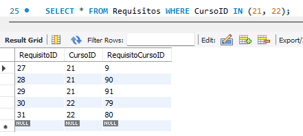

# Parte practica

Para la parte practica se realizan distintas ejecuciones de codigo de SQL en una base de datos creada.

## 1. Creacion de la base de datos y tablas
### a. Definicion y creacion de las tablas Cursos, Requisitos, y Descripciones usando el esquema proporcionado.

Mediante el codigo de sql [Crear Base de Datos](src/Create_Database.sql) se crea la base de datos respectiva con el esquema proporcionado.

Evidencia de la creacion de la base de datos Tarea6:

Se asegura de implementar las claves primarias, candidatas y foraneos. Verificacion de las llaves foraneas de las tablas Descripciones y Requisitos:

## 2. Insercion de datos

### a. Insercion de la informacion basica de los cursos y sus requisitos segun el plan de estudios proporcionado.

Mediante el codigo de sql [Insertar Informacion Basica](src/Insert_1_Basic_Data.sql) se inserta la informacion basica de los cursos con el plan de estudios proporcionado.

Antes de insertar los datos:

Despues de insertar los datos:

Notas:

-   Debido a que el plan de estudios proporcionado no posee informacion de dificultad de curso ni descripcion no se inserta nada en la tabla Descripciones.

-   Los cursos optativos se asigna un valor NULL en la columna Semestre de la tabla Cursos debido a que no poseen asignacion de semestre.

-   Los cursos de bachillerato que son requisitos de cursos de licenciatura se asigno un valor -1 en la columna Semestre de la tabla Cursos debido a que no son parte de ningun semestre del plan de estudios de licenciatura.

### b. Agregar dos cursos nuevos y completar la informacion requerida y sus respectivos requisitos

Mediante el codigo de sql [Insertar Cursos Nuevos](src/Insert_2_New_Courses.sql) se insertan dos cursos nuevos.

Antes de insertar los cursos nuevos:

Despues de insertar los cursos nuevos:

En las imagenes anteriores se aprecian que las nuevos dos filas anadidas en las tablas.

## 3. Consultas
### a. Realizar consultas para listar todos los cursos con su sigla, nombre, semestre, creditos, descripcion, y dificultad

Mediante el codigo de sql [Consultar datos](src/Consult_1_Data.sql) se realiza la consulta respectiva.

Resultados de la consulta:

### b. Realizar consultas para listar todos los requisitos de un curso especifico

Mediante el codigo de sql [Consultar requisitos](src/Consult_2_Required_Course.sql) se realiza la consulta de los requisitos de un curso especifico.

Resultados de la consulta:

### c. Realizar consultas para listar los cursos que no son optativos

Mediante el codigo de sql [Consultar cursos no optativos](src/Consult_3_Optative_Course.sql) se realiza la consulta de los cursos que no son optativos.

Resultados de la consulta:

Nota:

-   La condicion IS NOT NULL hace referencia a no seleccionar los cursos optativos debido a que se sigue la convencion de que los cursos optativos tiene un valor en la columna Semestre de NULL.
-   La condicion != -1 hace referencia a no seleccionar los cursos de bachillerado debido a que se sigue la convecion de que los cursos de bachillerato que son requisitos de cursos de licenciatura, pero no son cursos optativos de licenciatura tienen un valor en la columna Semestre de -1.

### d. Listar los cursos que pertenecen al semestre X.

Mediante el codigo de sql [Consultar cursos del semestre X](src/Consult_4_Semester_Course.sql) se realiza la consulta de los cursos que pertenecen a un semestre especifico.

Resultados de la consulta:

## 4. Actualizaciones

### a. Actualizar el nombre y creditos de 3 cursos optativos.

Mediante el codigo de sql [Actualizar el nombre y creditos](src/Update_1_Courses.sql) se actualiza el nombre y creditos de tres cursos.

Antes de la actualizacion:

Despues de la actualizacion:

Nota: Los codigos de SQL de la parte a y b estan dentro del mismo query. En el query posee comentarios sobre lo que se hace en cada accion.
### b. Actualizar la descripcion y dificultad de 3 cursos existentes.

Mediante el codigo de sql [Actualizar descripcion y dificultad](src/Update_1_Courses.sql) se actualiza la descripcion y dificultad de tres cursos.

Antes de la actualizacion:

Despues de la actualizacion:

## 5. Eliminaciones

### a. Eliminar un curso inventado y 2 cursos del plan y asegurarse de que tambien se eliminen sus descripciones asociadas.

Mediante el codigo de sql [Eliminar 3 cursos](src/Delete_1_Courses.sql) se elimina un curso inventado y dos cursos del plan.

Antes de eliminar los cursos:

Despues de eliminar los cursos:

Tambien se toma en consideracion que los cursos eliminados no pueden ser requisitos de otros cursos, por lo tanto tambien se elimina que sean requisitos.

Antes de eliminar:

Despues de eliminar:

Nota: la propiedad ON DELETE CASCADE al crear la base de datos deberia permitir la eliminacion de las filas de las tablas Descripciones y Requisitos que referencian filas de la tabla Cursos al eliminar una entrada. MySQL genero mensajes de error a pesar de tener la propiedad asignada, por lo que se opto por eliminar las entradas en las tablas Descripciones y Requisitos y por ultimo en Cursos para evitar el error.

### b. Eliminar requisitos de dos cursos existentes.

Mediante el codigo de sql [Eliminar Requisitos](src/Delete_2_Requires.sql) se eliminan los requisitos de dos cursos.

Antes de eliminar los requisitos:

Despues de eliminar los cursos:

